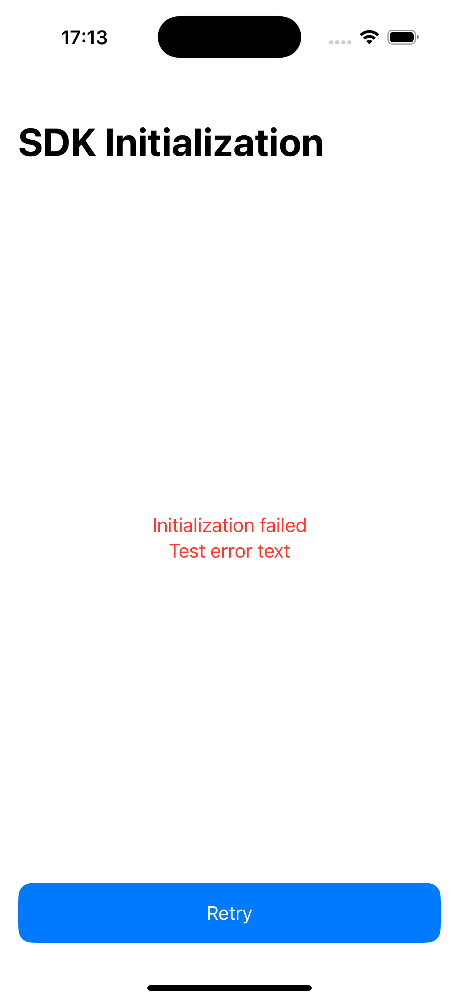
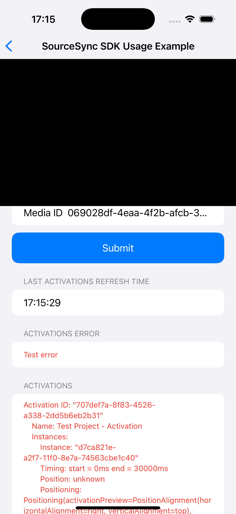

# Source Sync Core SDK Example

Implementation sample for SourceSyncCoreSDK implementation with minimal external dependencied.

Technologies used:

- Swift
- SwiftUI
- Swift Combine

## Minimal project requirements

- Xcode 16.0+
- iOS 17.6+

## Build and Run
To be able to run this project:
- fetch current Git repository
- run SourceSyncIntegration target

## Key integration points
#### SourceSyncSDKInteractor
This class is a singleton facade for interactions with SourceSyncSDK, every call to SDK must be inside it. This class is responsible for error handling and providing readable results to the screen that will be using it.

Public API:
1. `func initialize(depth: Int = 0) async -> SourceSyncInitializationStatus` - method initializes `PlatformApp`, logs errors and provides initialization status.
   Possible results are:
   - `none` - SDK is not initialized
   - `success` - SDK is initialized successfully
   - `inProgress` - initialization in progress
   - `failed(Error)` - successfully failed with specific error
2. `func initContent(mediaId: String) async -> SourceSyncResult<Content>` - creates instance of a Content using provided mediaId
   Possible results are:
   - `success(Content)` - Content created successfully
   - `failure(Error)` - Content is not available, failed with specific error
3. `func fetchActivations(content: Content, currentTimeMs: Int64, timeWindowMs: Int64) async -> SourceSyncResult<[Activation]>` - get activations for specific time and time window
   Possible results are:
   - `success([Activation])` - Activations fetched successfully
   - `failure(Error)` - Activations are not available, failed with specific error
4. `func close()` - cleanup resources
#### PreviewViewModel
1. `func submitVideoData()` - creates new content from provided data in Media URL field and Media ID
2. `func observeProgress()` - start to observe video player progress to be able to check for activations in real time
3. `func stopObservingProgress()` - unsubscribe from player progress updates
4. `func createDataSubject() -> any Subject<(Int64, Content), Error>` - creates subject that fetches activations and updates ui accordingly
## Demonstration
#### Success case demo
https://github.com/user-attachments/assets/07547a77-ea60-4c23-9700-20d3f441fa6e

#### Failed init

#### Failed preview

## Problems found
1. SDK package is missing Packages.swift file which would allow the SDK to be imported via Swift Package Manager.
2. Cocoapods is deprecated, so instead of using cocoa pods I decided to import package directly via framework attachment to xcode project.
3. After trying to initialise SDK with disabled network/internet - Unavoidable crash from client side. There’s no way to handle such an error due to standard error: Exception doesn't match @Throws-specified class list and thus isn't propagated from Kotlin to Objective-C/Swift as NSError. It is considered unexpected and unhandled instead. Program will be terminated.
4. Unexpected crashes while calling fetchActivations during seeking to different parts of the video - Tame:kfun:io.sourcesync.sdk.util.StaticIntervalTree# intervalsOverlappingInterval (1:0;io.sourcesync.sdk.util.StaticIntervalTree. SearchOptions) {} kotlin.collections.List<1:0>. The file path does not exist on the file system: /Users/runner/work/kmp-sourcesync-sdk-core/kmp-sourcesync-sdk-core/coreSdk/src/commonMain/kotlin/util/StaticIntervalTree.kt
5. Context creation process is not straightforward, no understanding of why you should use it and how.

## API improvement suggestions

1. A lot of unused parameters for Content instance construction, it is better to provide different constructors for different media types - URL, MediaID etc..
2. Expose all SDK methods and instance creation through SDK Facade pattern, so usage of the SDK would be intuitive. For example - create single instance of `SourceSyncCore`, from which developers would call:
   - `SourceSyncCore.createMediaIdContent(...)`
   - `SourceSyncCore.createUrlContent(...)`
   - `SourceSyncCore.fetchActivations(...)`
   - `SourceSyncCore.logEvent(...)`
3. Analytics available only through the single vendor with non-universal interface, it’s a good practice to expose analytics logger as interface, so client can provide his own tracking service. From the SDK side will be provided basic implementations for supported Analytic providers such as Firebase, Amplitude, OneSignal.
4.  After application initialization, there’s no need to pass instance of this app to other classes, it should be saved inside the sdk, since as far as I understood it is expected to have only one Application to be active.
5. It is better to move initialization process and error handling inside the SDK, to make integration straightforward for developers
